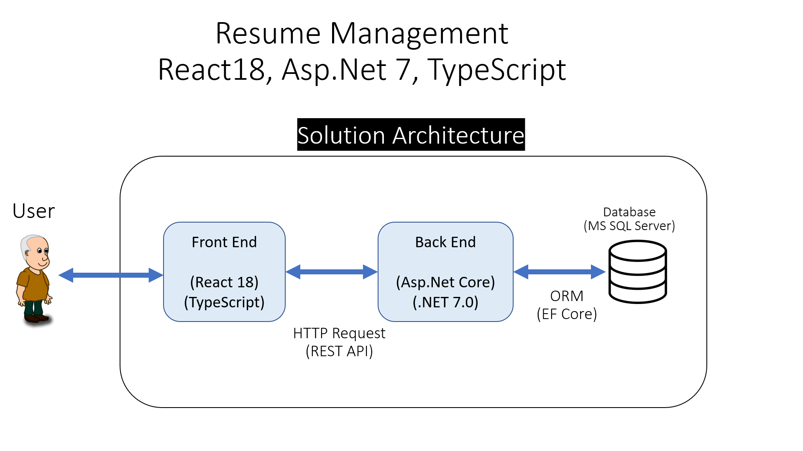
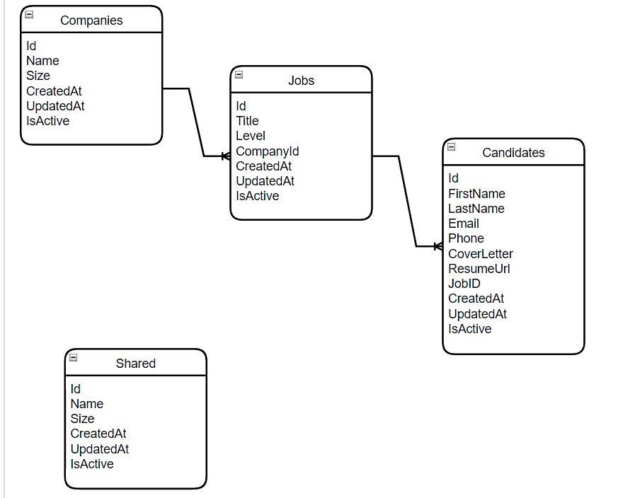

# Resume Management

## YouTube Tutorial
https://www.youtube.com/watch?v=AiwzQMupPsU

## Solution Technologies

-  Asp.Net Core (.NET 7.0)
-  React 18
-  TypeScript
-  MS SQL SERVER
-  Entity Framework Core

## Solution Architecture

## Database Structure

## We will learn these topics together

### On Backend project

-  Entities
-  Dtos
-  Context
-  ORM
-  Http Methods
-  Swagger
-  AutoMapper
-  Entities Relationtions
-  1 to Many Relation

### On Frontend project

-  Nested Routing
-  useState
-  useEffect
-  useContext
-  DarkMode
-  Elegant, Beatifull and fully Responsive Navbar
-  TypeScript Interfaces
-  Dtos
-  Axios
-  SASS
-  Mixin
-  Moment